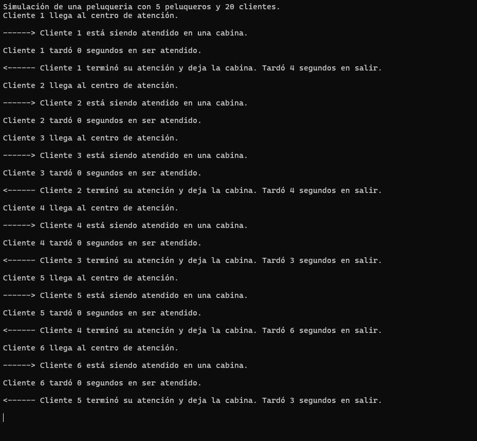

  

<h1 align="center">
  
</h1>

<b>Simulación de Procesos Multihilo | Universidad de Sonora</b>

 

<b>Creador y Modalidad</b>

* **Estudiante:** Natalia Valenzuela ([@NataliaVlza](https://github.com/NataliaVlza))
* **Institución:** Universidad de Sonora (UNISON) - Facultad Interdisciplinaria de Ingenierías
* **Modalidad:** Proyecto guiado y desarrollado en sesiones prácticas de laboratorio.
* **Contacto:** natalia28valenzuela@gmail.com
* **Ubicación:** Hermosillo, Sonora, México

 

<b>Descripción del Proyecto</b>

Proyecto de programación concurrente que simula el problema clásico de la <b>Peluquería / Barbería de Recursos Limitados</b>. La aplicación gestiona la llegada aleatoria de clientes utilizando <b>hilos (Threads)</b> y controla el acceso simultáneo a 5 cabinas de atención mediante un <b>Semáforo (Semaphore)</b>.

<b>Funcionalidades y Requisitos Implementados:</b>

* **Control de Concurrencia:** Uso de `Semaphore` para limitar el acceso simultáneo a un máximo de 5 cabinas.
* **Simulación de Clientes:** Cada cliente se ejecuta en un hilo independiente con tiempos de llegada de 2 a 8 segundos.
* **Tiempos de Atención:** Simulación del servicio (corte o barba) con una duración variable de 2 a 14 segundos.
* **Métricas e Historial:** Rastreo en consola de llegada, ingreso a cabina, liberación de espacio y cálculo individual del tiempo de espera.

 

<b>Imágenes del Proyecto</b>

<b>1. Ejecución de la Simulación y Registro de Tiempos</b> 
Muestra la consola de salida rastreando el flujo en tiempo real: llegada de los clientes, asignación de cabina controlada por el semáforo, tiempo de espera transcurrido y liberación del recurso tras finalizar la atención.

 

Créditos de componentes visuales: <a href="https://github.com/kyechan99/capsule-render/blob/main/docs/README_es.md">capsule-render</a> por @kyechan99 y <a href="https://github.com/denvercoder1">readme-typing-svg</a> por @DenverCoder1

  

