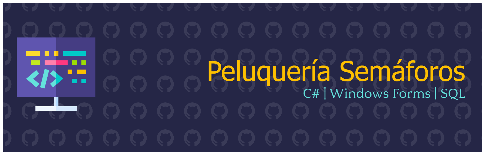

## Creador
- **Estudiante:** Natalia Valenzuela ([@NataliaVlza](https://github.com/NataliaVlza))
- **Institución:** Universidad de Sonora (UNISON)
- **Modalidad:** Proyecto guiado y desarrollado en sesiones prácticas de laboratorio.

---

## Descripción
Proyecto de programación concurrente que simula el problema clásico de la **Peluquería / Barbería de Recursos Limitados**. La aplicación gestiona la llegada aleatoria de clientes utilizando **hilos (Threads)** y controla el acceso simultáneo a 5 cabinas de atención mediante un **Semáforo (`Semaphore`)**.

### Funcionalidades y requisitos implementados:
- **Control de Concurrencia:** Uso de `Semaphore` para limitar el acceso simultáneo a un máximo de 5 cabinas.
- **Simulación de Clientes:** Cada cliente se ejecuta en un hilo independiente con tiempos de llegada de 2 a 8 segundos.
- **Tiempos de Atención:** Simulación del servicio (corte o barba) con una duración variable de 2 a 14 segundos.
- **Métricas e Historial:** Rastreo en consola de llegada, ingreso a cabina, liberación de espacio y cálculo individual del tiempo de espera.

## Imágenes del Proyecto

### 1. Ejecución de la Simulación y Registro de Tiempos
Muestra la consola de salida rastreando el flujo en tiempo real: llegada de los clientes, asignación de cabina controlada por el semáforo, tiempo de espera transcurrido y liberación del recurso tras finalizar la atención.  

